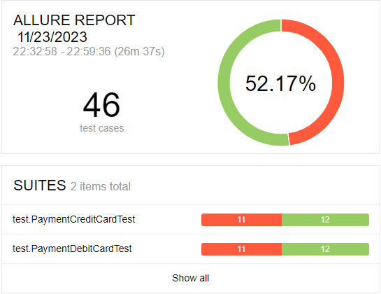

# Отчет о тестировании

Краткий отчет по результату автоматизированного тестированию функционала и 
оформления кредита по предоставленным данным карты для покупки тура.

### Краткое описание:
- Была выполнена автоматизация функционального ручного тестирования покупки тура в Марракеш.
- Проверена поддержка двух заявленных СУБД: MySQL и PostgreSQL. Приложение успешно функционирует с каждой из заявленных СУБД.

**Количество проверенных тест-кейсов:**
- 23 тест-кейса для оплаты тура по дебетовой карте;
- 23 тест-кейса для покупки тура в кредит.

**Результат успешных и не успешных**
- Кол-во успешных тест-кейсов: 24 тест-кейсов (52,17 %);
- Кол-во не успешных тест-кейсов: 22 тест-кейсов (47,83 %).

Тест-кейсы содержат UI тесты и запросы, проверяющие информацию в БД.

Отчет по результатам тестирования Allure:

**Общие рекомендации**

1. Исправить ошибки связанные с орфографией.
2. Для поля ввести ограничение на ввод данных только латиницей.
3. Исправить заголовок страницы.
4. Исправить отображение в таблице бд (Для колонки "armount").
5. Убрать возможность оплаты с деактивированной картой.
6. Ввести ограничение на ввод данных для атрибута "Месяц" (сделать только ввод цифрами).

